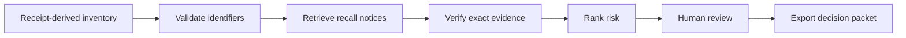

# RecallRadar

> An AI agent that checks household purchases against product recalls, verifies exact identifiers, and prepares the safest next action.

<p align="center">
  <a href="https://recallradar-ofegn2yso5jbkc3tpgejhm.streamlit.app/"><strong>Open the live app</strong></a>
  ·
  <a href="docs/DEMO_SCRIPT.md"><strong>Watch the demo flow</strong></a>
  ·
  <a href="docs/ARCHITECTURE.md"><strong>Read the architecture</strong></a>
</p>

<p align="center">
  <a href="https://recallradar-ofegn2yso5jbkc3tpgejhm.streamlit.app/">
    
  </a>
  
  
  
</p>

## The problem

Recall notices are scattered across agencies and news feeds. People must notice an announcement, remember what they bought, find a model or lot number, interpret the warning, and decide what to do.

RecallRadar changes that workflow. It turns receipt-derived records into a safety inventory, checks them against recall notices, suppresses weak matches, and surfaces only decisions that need a person.

## 30-second product tour

1. Upload a simple product inventory or use the synthetic demo.
2. Search the official U.S. CPSC recall feed.
3. Verify model, lot, UPC, brand, and product evidence.
4. Suppress ambiguous candidates instead of creating false alarms.
5. Review the hazard, official notice, recommended remedy, and prepared message.
6. Approve or dismiss the action. RecallRadar never contacts a company automatically.
7. Export a CSV decision report and JSON audit packet.

**Try it:** [recallradar-ofegn2yso5jbkc3tpgejhm.streamlit.app](https://recallradar-ofegn2yso5jbkc3tpgejhm.streamlit.app/)

> Demo mode uses synthetic household data and requires no API key. Live mode depends on the availability and coverage of the CPSC public recall service.

## Architecture

[](docs/architecture.svg)

The Strands agent orchestrates the workflow. Deterministic Python tools handle safety-critical matching and risk rules; the model selects tools, explains the evidence, and prepares a decision brief. Every external action remains behind a human approval gate.



## Engineering decisions

| Challenge | Design choice |
|---|---|
| Similar product names can create false alarms | Exact model, lot, or UPC evidence is prioritized |
| Live government data may be incomplete or unavailable | The app reports source limits and never substitutes synthetic results in live mode |
| AI should not make irreversible safety decisions | The agent prepares actions but requires human approval |
| Recruiters and judges need a reliable walkthrough | A key-free synthetic demo runs without AWS or Gemini credentials |
| Results should be inspectable | Every surfaced match includes evidence and an exportable audit packet |

## What I built

- A complete Streamlit product experience with an animated monitoring interface
- A Strands agent with custom tools for inventory loading, recall retrieval, exact matching, and action preparation
- A live adapter for the U.S. Consumer Product Safety Commission recall service
- Conservative matching rules that reject same-brand, wrong-model candidates
- Risk classification and evidence-backed action packets
- Human approve/dismiss controls with no automatic external submission
- CSV and JSON exports for operational review and auditability
- Tests covering matching logic and safety boundaries
- Optional Google Gemini and Amazon Bedrock execution paths
- A recurring monitor that remembers previously surfaced decisions

## Technology

`Python` · `Streamlit` · `Pandas` · `Strands Agents SDK` · `Google Gemini` · `Amazon Bedrock` · `CPSC API` · `Pytest` · `Docker`

## Run locally

```bash
git clone https://github.com/ShrutiVan17/RecallRadar.git
cd RecallRadar
python -m venv .venv
# Windows: .venv\Scripts\activate
# macOS/Linux: source .venv/bin/activate
pip install -r requirements.txt
streamlit run app.py
```

Click **Run guided safety scan**. Demo mode uses synthetic household data and requires no cloud credentials.

## Agent execution options

### Strands + Google Gemini

Create a Gemini API key in Google AI Studio and keep it outside GitHub.

```powershell
$env:GEMINI_API_KEY="YOUR_KEY"
$env:RECALLRADAR_PROVIDER="gemini"
streamlit run app.py
```

### Strands + Amazon Bedrock

Follow the complete [AWS setup guide](docs/AWS_SETUP.md), configure your normal AWS credentials, and run:

```bash
export RECALLRADAR_USE_STRANDS=1
export RECALLRADAR_MODEL_ID="us.amazon.nova-lite-v1:0"
streamlit run app.py
```

If a model provider is unavailable, the deterministic demo still demonstrates the matching, safety, and decision workflow.

## Live CPSC mode

Select **Official CPSC · live** in the sidebar. RecallRadar searches the U.S. Consumer Product Safety Commission feed using each product model or name.

It never substitutes synthetic notices when a live search returns no results. CPSC does not cover every category; food, medicine, vehicles, and other regulator-specific recalls are outside this prototype's live scope.

## Inventory format

Only `name` or `product_name` is required. Reliable matching benefits from at least one exact identifier: `model`, `lot`, or `upc`.

Friendly headers such as `manufacturer`, `model_number`, `lot_number`, `barcode`, and `store` are also accepted. The app includes a downloadable CSV template.

## Repository map

| Path | Purpose |
|---|---|
| `app.py` | Streamlit product experience |
| `monitor.py` | Recurring monitor with new-decision memory |
| `recallradar/agent.py` | Strands agent and custom tools |
| `recallradar/core.py` | Conservative matching and risk rules |
| `recallradar/sources.py` | Demo and live CPSC sources |
| `data/` | Synthetic, privacy-safe demo records |
| `tests/` | Matching and safety-gate tests |
| `docs/architecture.svg` | System architecture |
| `docs/DEMO_SCRIPT.md` | Under-five-minute demonstration script |
| `DEVPOST.md` | Hackathon submission copy |

## Tests

```bash
pytest -q
```

## Responsible-use boundaries

- Demo records are synthetic.
- A surfaced match is a lead, not an official safety determination.
- Low-confidence candidates are withheld.
- RecallRadar never submits a claim or contacts a company without approval.
- Users should verify every match on the linked official agency notice.
- No secrets, receipts, or personal information are committed to the repository.

## Project context

Built by **Shruti Vanparia** for the **Agents for Humans Hackathon**, Everyday Agents track.

The next product steps are encrypted receipt-email ingestion, barcode and image extraction, FDA and NHTSA adapters, scheduled cloud scans, notifications, and production observability.

## License

MIT — see [LICENSE](LICENSE).
