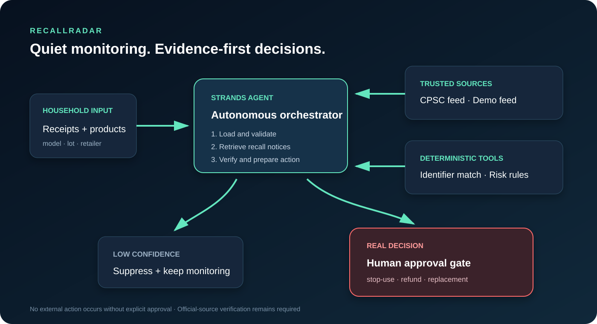

# RecallRadar

> A quiet AI agent that finds product recalls hiding in everyday purchases and prepares the safest next action.

RecallRadar turns receipts and household inventory records into an animated, continuously checkable safety inventory. It compares exact model, lot, brand, and product details against recall notices, rejects weak matches, and surfaces only decisions that need a person.

## Why it matters

Recall announcements are scattered across agencies and news feeds. People rarely remember model numbers, return windows, or which retailer sold an item. A search app still requires the person to remember to search. RecallRadar performs the repetitive work: normalize the inventory, retrieve notices, verify candidates, rank risk, prepare evidence, and draft the next action.

## What the agent does

1. Loads a receipt-derived household inventory.
2. Validates identifiers and flags records that need better evidence.
3. Retrieves a demo feed or current CPSC recall notices.
4. Matches conservatively using model/lot identifiers plus brand and product evidence.
5. Rejects ambiguous candidates instead of creating panic.
6. Prepares a stop-use, refund, replacement, or contact-manufacturer action packet.
7. Requests human approval before any external action.

## Architecture

The Strands agent is the orchestrator. Deterministic Python tools perform safety-critical matching and calculations; the model selects tools, explains evidence, and decides what to surface. External actions remain behind a human approval gate.

## Fastest demo

~~~bash
git clone https://github.com/ShrutiVan17/RecallRadar.git
cd RecallRadar
python -m venv .venv
# Windows: .venv\Scripts\activate
# macOS/Linux: source .venv/bin/activate
pip install -r requirements.txt
streamlit run app.py
~~~

Click **Start animated safety scan**. Demo mode requires no AWS keys and uses synthetic household data.

### Background mode

Run one check with `python monitor.py --once`, or keep the agent watching with `python monitor.py --source live --interval 3600`. It stores only previously surfaced match IDs and emits new decision packets, so unchanged conditions stay quiet.

## Free Strands route: Google Gemini

Gemini 2.5 Flash-Lite can run RecallRadar through the real Strands agent without an AWS account. Create a Gemini API key in Google AI Studio, keep it outside GitHub, then run:

~~~powershell
$env:GEMINI_API_KEY="YOUR_KEY"
$env:RECALLRADAR_PROVIDER="gemini"
streamlit run app.py
~~~

Choose **Strands + Gemini free tier** in the sidebar.

## Optional route: Strands + Amazon Bedrock

For a complete Windows walkthrough, use [AWS setup](docs/AWS_SETUP.md).

Configure AWS credentials using the AWS CLI or your normal AWS environment. Do not paste credentials into source code.

~~~bash
aws configure
# Windows PowerShell:
$env:RECALLRADAR_USE_STRANDS="1"
# macOS/Linux:
export RECALLRADAR_USE_STRANDS=1
streamlit run app.py
~~~

The SDK defaults to Amazon Bedrock. Your AWS identity needs permission to invoke the configured model. Optionally set:

~~~bash
export RECALLRADAR_MODEL_ID="us.amazon.nova-lite-v1:0"
~~~

If Bedrock is unavailable, the product remains demonstrable in deterministic demo mode; the repository still contains the full Strands orchestration path.

## Live CPSC feed

Select **Live CPSC feed** in the sidebar. RecallRadar queries the U.S. Consumer Product Safety Commission feed and falls back gracefully if the service is unavailable. Live results depend on source availability and field completeness.

## Repository map

| Path | Purpose |
|---|---|
| `app.py` | Complete Streamlit product experience |
| `monitor.py` | Quiet recurring monitor with new-decision memory |
| `docs/AWS_SETUP.md` | Secure Bedrock connection walkthrough |
| `recallradar/agent.py` | Strands agent and custom tools |
| `recallradar/core.py` | Conservative matching and risk rules |
| `recallradar/sources.py` | Demo and live CPSC recall sources |
| `data/` | Synthetic, privacy-safe demo records |
| `tests/` | Matching and safety-gate tests |
| `docs/architecture.svg` | Submission-ready architecture diagram |
| `docs/DEMO_SCRIPT.md` | Under-five-minute video script |
| `DEVPOST.md` | Submission copy |

## Safety and privacy

- Demo records are synthetic.
- A match is a lead, not an official safety determination.
- Low-confidence results are withheld.
- RecallRadar never submits a claim or contacts a company without approval.
- Users should verify any match on the linked official agency notice.
- No secrets, receipts, or personal information are committed to the repository.

## Tests

~~~bash
pytest -q
~~~

## Hackathon

Built for the **Agents for Humans Hackathon**, Everyday Agents track, with the Strands Agents SDK. AgentCore is an optional next deployment step.

## License

MIT — see [LICENSE](LICENSE).
